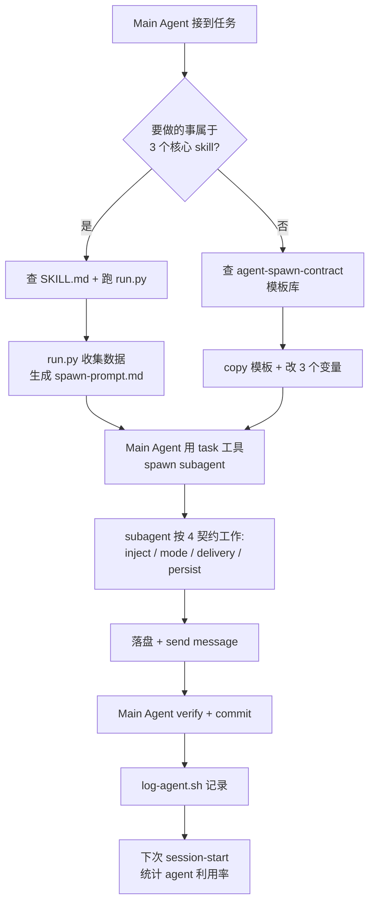

## Product Overview

工作室进化方案 · 组合 A「攻心」：把 bolt-1-1 retro 暴露的核心痛点（99% SOP 是 markdown 摆设、agent 利用率仅 ~10%、用户反馈 3 轮才到位）从根上改掉。**不再添 agent，而是把现有资产真正"通电"**——让 main agent 在压力下也会 spawn agent，而不是"先修 bug 要紧"全自己干。

最终目标：下一次起新项目（platformer-2 端到端验证）时，agent 利用率从 10% → 50%+，用户反馈轮次从 3 → ≤1，main agent 上下文消耗显著下降。

## Core Features

### 1. 反模式知识库 + session 启动注入

- 沉淀 retro 第六节 8 条通用反模式（agent 自己干一切 / spawn cost 心理 / 角色不一致 / .import 静默 fallback / 限流硬撞 / 反馈无沉淀 / settings 失效 / 复合命令审批）到 `studio/docs/anti-patterns.md`
- 每条含：症状 / 检测信号 / 修法 / 关联 retro 锚点 / 关联 rule
- session-start hook 自动注入摘要 + 上次会话 agent spawn 统计，强制 main agent 每次启动都"看到"反模式

### 2. Agent spawn 模板库（让 spawn 比自己干快）

- 在现有 `agent-spawn-contract` 4 契约（现状注入 / 任务模式 / 交付-关闭 / 落盘）基础上追加 5-10 个**完整可粘贴**的 task prompt 模板
- 覆盖高频场景：单 story 实现 / milestone gate 三方综合 / GDD 章节起草 / 回归 bug 排查 / 资产评审 / 视觉一致性审 / 测试编写 / commit 前 review
- 每个模板包含：mode / inject 内容清单 / output_path / spawn 后协议 / 验证步骤
- main agent 看到就能直接 copy + 改 3 个变量 spawn

### 3. 核心 skill 从文档升级为可执行 pipeline

把 3 个最高频 skill 从 markdown 流程指引升级为命令行可调用的 `run.py`：

- **qa-gate**：自动跑测试 + 收 7 项指标 + spawn qa-lead → 落 report → 输出 verdict
- **milestone-review**：spawn qa-lead + producer + reviewer 三方 → 聚合写 report + 自动落 backlog + stage 切换提案
- **dev-story**：story 状态机 + chain spawn engineer → tester → reviewer，全程 contract 校验

### 4. 端到端验证项目 platformer-2

- 起一个全新小项目跑完整 M0-M2 闭环（GDD → prototype → vertical slice）
- **强制使用** spawn 模板和 run.py，不允许 main agent 独角戏
- 落 `studio/reports/evolution-combo-a-validation.md` 对比 bolt-1-1 vs platformer-2 的：agent 利用率 / 反馈轮次 / 上下文消耗 / 返工次数

### 5. 不在本次范围

- v4 迁移批 7-12 收尾（BL-S003 长期跟进）
- godot 项目模板抽离（BL-S007 后续）
- commit-discipline hook 强制（BL-S004 后续）
- timiai-image fallback（BL-S006 后续）
- 31 agent 内容 / 25 skill 中其他 22 个均不动

## Tech Stack

- **文档层**：Markdown（anti-patterns / spawn 模板 / validation 报告）
- **可执行层**：Python 3.x（3 个 run.py，参考 `.codebuddy/skills/timiai-image/scripts/` 的成熟结构 — cache + batch + pipeline + daemon + postprocess 5 模块拆分思路）
- **Hook 层**：Shell（session-start.sh 现存，追加注入逻辑）
- **Spawn 接口**：使用现有 CodeBuddy `task` 工具调用 subagent；run.py 通过生成结构化 prompt 输出到 stdout 让 main agent 拾取（非直接调 LLM API），保持与现有 codebuddy session 兼容
- **验证项目**：Godot 4.6.2（已装在 `engine/Godot/`）+ GDScript

## Implementation Approach

### 核心策略：不破坏 + 增量通电

retro 已诊断核心问题不是"agent 不够多"，而是"现有 agent 没被调用"。因此本方案严格遵守：

1. **31 agent 内容零改动**（视作能力库）
2. **25 skill 文档零删除**（仅 3 个 skill 加 run.py 兄弟文件，原 SKILL.md 保留作为 pipeline 步骤说明）
3. **现有 hook 增量追加**，不重写

### 关键技术决策

**决策 1 · run.py 不直接调 LLM，而是输出"标准化 spawn 指令"**
理由：CodeBuddy 的 task 工具是 main agent 主动调用的。run.py 直接调 LLM API 会绕过现有审计 / 权限链，且每个 IDE 会话上下文不一致。改为：run.py 收集数据 → 生成符合 agent-spawn-contract 4 契约的完整 prompt → 输出到 stdout / 写到 `temp/spawn-prompt.md` → main agent 看到提示后用 task 工具 spawn。这样既"通电"（数据采集 / 模板填充自动化）又不破坏现有协作流。

**决策 2 · Anti-patterns 注入用"摘要 + 详情链接"双层**
理由：session-start 每次执行不能塞 300 行进上下文（token 浪费），但又不能只放标题（信息密度不够）。采用：摘要 = 8 条 × (症状 1 句 + 修法 1 句) = ~30 行；详情按需 read_file。

**决策 3 · validation 项目 platformer-2 不与 bolt-1-1 重叠**
理由：复用 bolt-1-1 会有 bias（main agent "记得"上次怎么做）。重新起 platformer-2，强制走全套 SOP，对比数据更干净。

**决策 4 · spawn 模板嵌入 rule 而非独立文件**
理由：现有 `agent-spawn-contract/RULE.mdc` 已经写得不错（4 契约 + 反模式速查 + 验证清单 6 项）。再独立建文件会割裂。在末尾追加 `## 高频 spawn 模板库` 段，与 4 契约同卷，main agent 加载 rule 时自动看到。

### 性能 & 复杂度

- run.py 全是 I/O bound（read_file + 字符串模板 + 写 prompt 文件），无算法热点
- session-start hook 不能慢：anti-patterns 摘要必须预生成（不在 hook 里实时解析 300 行 md），用 `studio/docs/anti-patterns-digest.md` 作预渲染产物，hook 只 cat
- platformer-2 验证：Godot headless `--check-only` 在每次 GDScript 改动后跑（参考 memory 已有约定），单次 < 5s

### 避免技术债

- 不引入新 Python 库依赖（run.py 只用 stdlib：argparse / json / pathlib / subprocess）
- 不引入新文档格式（保持 .md / .sh / .py）
- 不动 31 agent 任何 frontmatter / 提示词
- 沿用现有 backlog 格式（`projects/<name>/stories/backlog.md` + `studio/backlog.md`）

## Implementation Notes

### Grounded（基于探索）

- `agent-spawn-contract/RULE.mdc` 已有 4 契约 + 验证清单 6 项 — **追加** `## 模板库` 段，不重写前文
- `qa-gate/SKILL.md` 现 143 行已有 7 项指标 + 阈值表 + 自主模式强制门 — **直接转**为 run.py 的数据契约（`metrics.json` schema）
- `milestone-review/SKILL.md` 现 55 行 3 处 `[Phase 2 TODO]` — 这次正好兑现，转 run.py
- `timiai-image/scripts/` 是工作室唯一真正"通电"的 skill — run.py 拆分思路（cache.py / pipeline.py / daemon.py）作参考
- `session-start.sh` 现存 — 不重写，末尾追加 `cat anti-patterns-digest.md` + 调 log-agent.sh 统计
- `studio/docs/retro-bolt-1-1-experience.md` 第六节 8 条反模式 — **复制改写**到 anti-patterns.md，不二次创作

### Performance

- session-start hook 注入摘要 ≤ 50 行（避免上下文膨胀）
- run.py spawn-prompt 写到 `.codebuddy/temp/`（git ignore），避免污染 commit
- platformer-2 不重复造轮子：复用 bolt-1-1 已有 sprite_helper.gd / camera_follow.gd 的设计模式（拷贝即可，不抽 template — 那是 BL-S007 的活）

### Logging

- run.py 复用 `log-agent.sh`（已存在）记录 spawn 调用，daily-check 时可统计 agent 利用率
- 不引入新 logger，stdout 即日志

### Blast Radius Control

- 所有改动**只追加不删除**：anti-patterns.md / 模板段 / run.py 都是新增；session-start.sh 末尾追加；3 个 SKILL.md 保持不变
- 失败回退：删除新增文件 + git revert session-start.sh 即可恢复
- platformer-2 是新项目，与 bolt-1-1 / breakout 完全隔离

## Architecture Design

### 数据流（spawn 通电链路）



### 模块关系

```
studio/docs/
  ├── anti-patterns.md           ← 新增·完整 8 条反模式
  └── anti-patterns-digest.md    ← 新增·摘要预渲染产物（hook cat）

.codebuddy/
  ├── rules/agent-spawn-contract/RULE.mdc  ← 追加·模板库段（5-10 个）
  ├── hooks/session-start.sh               ← 追加·注入摘要 + 统计
  ├── skills/
  │   ├── qa-gate/
  │   │   ├── SKILL.md           ← 不变（流程文档）
  │   │   └── run.py             ← 新增·可执行
  │   ├── milestone-review/
  │   │   ├── SKILL.md           ← 不变
  │   │   └── run.py             ← 新增
  │   └── dev-story/
  │       ├── SKILL.md           ← 不变
  │       └── run.py             ← 新增
  └── temp/                      ← 新增·spawn-prompt 暂存（gitignore）

projects/platformer-2/           ← 新增·验证项目
  ├── PROJECT.md
  ├── gdd/
  ├── stories/
  └── game/

studio/reports/
  └── evolution-combo-a-validation.md  ← 新增·对比报告
```

## Directory Structure

```
GameStudio/
├── studio/
│   ├── docs/
│   │   ├── anti-patterns.md                       # [NEW] 8 条通用反模式完整版（~300 行）。每条含：症状 / 触发场景 / 检测信号（grep 模式 / 行为线索）/ 修法 / 关联 retro 锚点 / 关联 rule。从 retro-bolt-1-1-experience.md 第六节复制改写为通用版（剥离 bolt-1-1 specific 描述）。作为权威知识源。
│   │   └── anti-patterns-digest.md                # [NEW] 摘要版（~50 行）。8 条 × (1 行症状 + 1 行修法 + 详情链接)。供 session-start hook 直接 cat 注入，避免 token 浪费。
│   └── reports/
│       └── evolution-combo-a-validation.md        # [NEW] 端到端验证报告（~200 行）。对比 bolt-1-1 vs platformer-2：agent spawn 次数 / 用户反馈轮次 / 主上下文 token 估算 / 返工 commit 数 / 反模式触发次数。结论 PASS/FAIL + 后续建议。
├── .codebuddy/
│   ├── rules/
│   │   └── agent-spawn-contract/
│   │       └── RULE.mdc                           # [MODIFY] 现 117 行 4 契约保留不动。在末尾（## 验证清单 之后）追加 `## 高频 spawn 模板库` 大段（~400 行）。包含 8 个完整可粘贴模板：1) 实现单 story 2) milestone gate 三方综合 3) GDD 章节 DRAFT/REFINE 4) 回归 bug 根因排查 5) 资产入库前评审 6) 跨 chapter 一致性审 7) 测试用例编写 8) commit 前 code review。每模板含 mode / inject 清单 / output_path / spawn 后协议 / 验证 6 项。
│   ├── hooks/
│   │   └── session-start.sh                       # [MODIFY] 现存。末尾追加（不重写前文）：cat studio/docs/anti-patterns-digest.md；调 log-agent.sh 统计上一会话 agent spawn 次数 + skill 调用次数；输出"上次 utilization: X% / 本次目标 ≥ 50%"提示行。
│   ├── skills/
│   │   ├── qa-gate/
│   │   │   ├── SKILL.md                           # [UNCHANGED] 现 143 行流程文档保留作 pipeline 步骤说明。
│   │   │   └── run.py                             # [NEW] (~250 行) 命令行入口 `python run.py --scope sprint|milestone|release --project <name>`。功能：1) 收集 7 项指标（跑 run-tests.ps1 / godot --check-only / 读 consistency 报告 / 解析 backlog VISUAL_DEBT 数 / 检测真实路径测试存在性）2) 按场景查阈值表 3) 生成 spawn-prompt for qa-lead（含 4 契约：metrics.json inject / mode=REVIEW / output_path=reports/qa-gate-*.md）4) 写 prompt 到 .codebuddy/temp/spawn-prompt-qa-gate-<ts>.md 5) stdout 输出"请用 task 工具 spawn qa-lead，prompt 见 ↑"。stdlib only。
│   │   ├── milestone-review/
│   │   │   ├── SKILL.md                           # [UNCHANGED] 现 55 行保留，3 个 [Phase 2 TODO] 由 run.py 兑现。
│   │   │   └── run.py                             # [NEW] (~280 行) 命令行入口 `python run.py --from <stage> --to <stage> --project <name>`。功能：1) 读 PROJECT.md 校验 stage 字段 2) 调 qa-gate/run.py 拿 verdict 3) 聚合最近 3 sprint smoke + retros action items + backlog due ≤ 当前 milestone 4) 生成三方 spawn-prompt（qa-lead 看测试 / producer 拍板 / reviewer 看代码质量）5) 输出 milestone-<from>-to-<to>-<date>.md 草稿（待 main agent spawn 三方填充结论）6) 不自动改 PROJECT.md stage，只提建议。
│   │   └── dev-story/
│   │       ├── SKILL.md                           # [UNCHANGED]
│   │       └── run.py                             # [NEW] (~220 行) 命令行入口 `python run.py --story <path> --action ready|implement|test|review|done`。状态机：READY → IMPLEMENTING → TESTING → REVIEWING → DONE。每个 action 生成对应 spawn-prompt（implement → engineer / test → tester / review → reviewer），自动 inject 该 story md 全文 + 关联 GDD 章节 + 现有相关代码片段。每步完成后跑 consistency-check（如 skill 存在）+ 更新 story frontmatter status。
│   └── temp/                                      # [NEW] (gitignore) spawn-prompt 临时暂存目录。run.py 写 prompt 文件到这里供 main agent 拾取。
└── projects/
    └── platformer-2/                              # [NEW] 端到端验证项目。强制走全套 SOP。
        ├── PROJECT.md                             # [NEW] 元数据：engine=Godot 4.6.2 / phase=pre-production / milestones=M0/M1/M2
        ├── README.md                              # [NEW] 项目快速开始 + smoke checklist
        ├── gdd/                                   # [NEW] 由 design-review skill + designer agent spawn 产出（不 main agent 写）
        ├── stories/
        │   ├── backlog.md                         # [NEW] 项目级 backlog（与 studio/backlog.md 区分）
        │   └── (M0-M2 stories，由 create-stories skill 产出)
        ├── retros/
        ├── reports/
        ├── qa/
        │   └── run-tests.ps1                      # [NEW] 标准测试入口（参考 bolt-1-1）
        └── game/                                  # [NEW] Godot 项目根（由 setup-engine skill 产出，main agent 不手写脚手架）
```

## Agent Extensions

### SubAgent

- **art-director**
- Purpose: 在 platformer-2 验证项目的视觉资产入库前评审；同时作为 spawn 模板库中"资产入库前评审"模板的真实调用对象，验证模板可用性
- Expected outcome: 至少 1 次正式 spawn 通过 task 工具发起，落盘评审 verdict 到 `projects/platformer-2/reports/art-review-*.md`，作为 validation 报告的"agent 真正被用起来"的证据

- **docs-writer**
- Purpose: 起草 `studio/docs/anti-patterns.md` 和 `anti-patterns-digest.md`（这是 docs-writer 的核心职责：terminology consistency + cross-doc）；同时验证 spawn-templates 模板 1 "GDD 章节 DRAFT/REFINE" 在真实场景下的契约 6 项是否都过得去
- Expected outcome: anti-patterns.md 由 docs-writer 通过模板化 spawn 产出（main agent 不直接写），且交付方式严格遵循 agent-spawn-contract 4 契约（inject 现状 + mode=DRAFT + output_path 明确 + 落盘 verify）